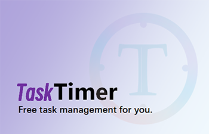
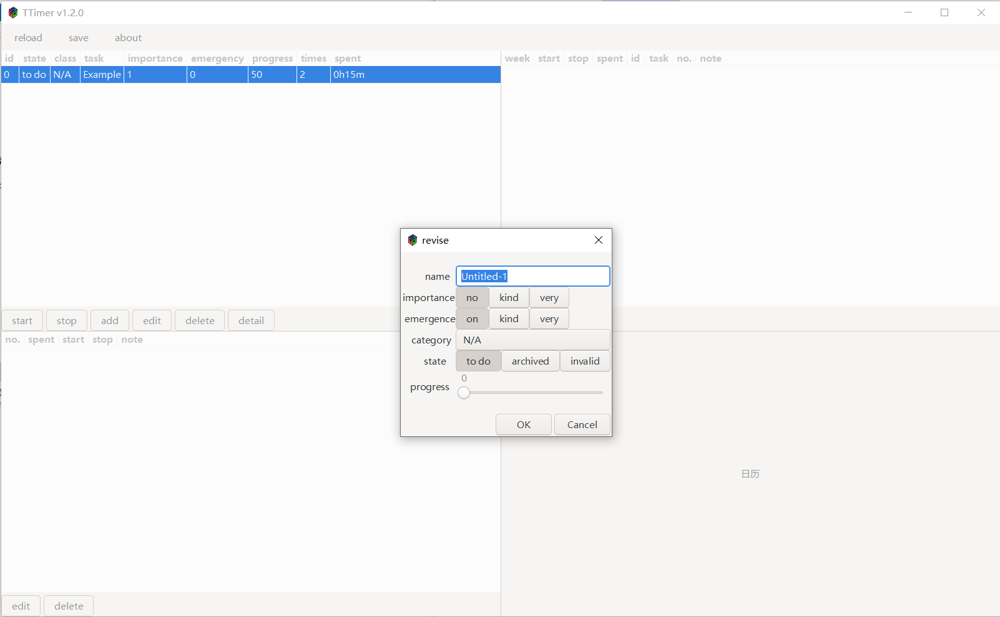
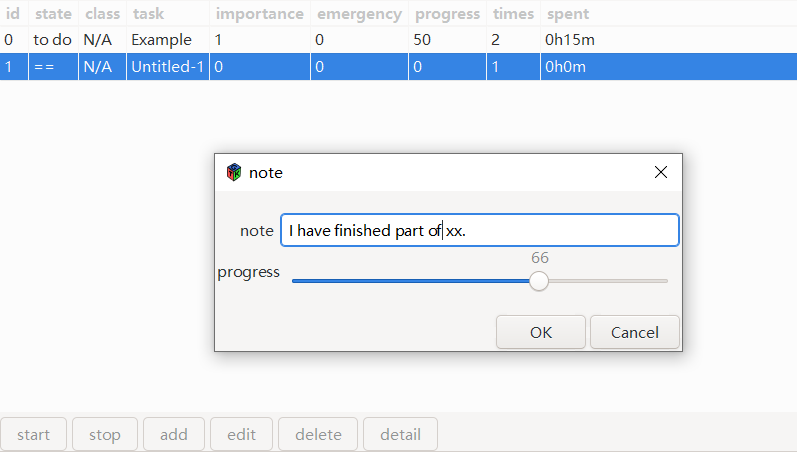
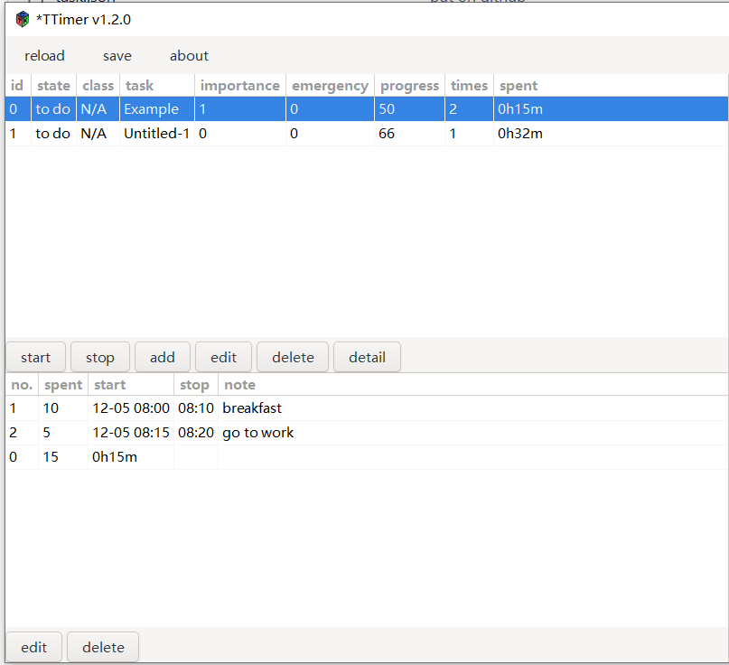
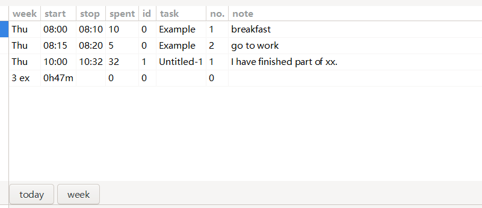

# TaskTimer: a timer to record your to do list.
TaskTimer is more than a todo list. You need the it if you want to know
- how much time you spent for every task
- how you finish one task step by step
- where is your time every day/week/month

## Function1: add/delete/revise one task

## Function2: start/stop one task

## Function3: show the execution detail of one task

## Function4: show today's execution
